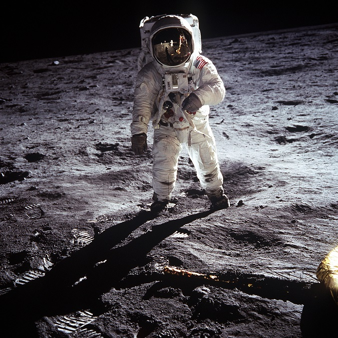
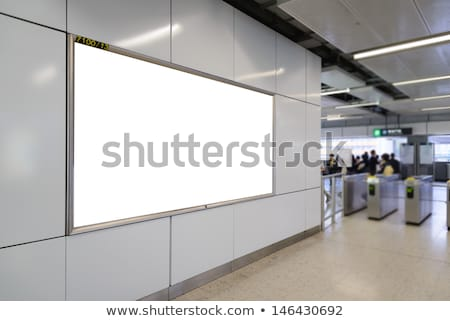
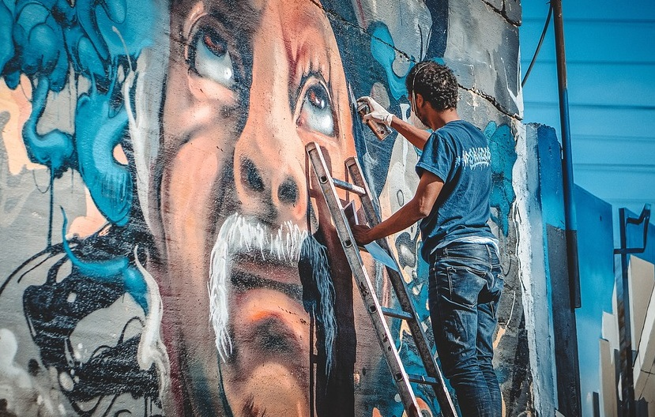

# Perspective-Projection-demo
透视变换
# 使用素材


提供文件夹内图片和在线图片可选

# <center><font color=blue>**一、单应性变换 —— 矩形$\Leftrightarrow$不规则四边形<font color=red>（scikit-image)**</font></font></center>
## <center><font color=blue>**1、矩形$\Rightarrow$不规则四边形**</font></center>
```bash
import cv2
import matplotlib.pyplot as plt
import numpy as np
import urllib.request

# 图片
resp = urllib.request.urlopen('https://github.com/user-attachments/assets/1cc51066-aa37-41e8-896e-250e943616ee')
image_data = np.asarray(bytearray(resp.read()), dtype="uint8")
humming = cv2.imdecode(image_data, cv2.IMREAD_COLOR)

def show_with_matplotlib(ax, img, title):
    """Shows an image using matplotlib capabilities on a given axis"""
    img_RGB = img[:, :, ::-1]  # Convert BGR to RGB
    ax.imshow(img_RGB)
    ax.set_title(title)
    ax.axis('off')  # Hide axis

# 读取输入图像
#image = cv2.imread('./images/humming.png')
image = humming
assert image is not None, "file could not be read, check with os.path.exists()"

# 定义源图像和目标图像的四个点
# 获取图像的尺寸
height, width = image.shape[:2]

# 定义源图像的四个角点
pts1 = np.float32([
    [0, 0],  # 左上角
    [width - 1, 0],  # 右上角
    [0, height - 1],  # 左下角
    [width - 1, height - 1]  # 右下角
])
pts2 = np.float32([[175, 295], [422, 60], [147, 538], [781, 400]])

# 在源图像上绘制选取的点
'''for p in pts1:
    cv2.circle(image, (int(p[0]), int(p[1])), 6, (0, 0, 255), -1)
'''

# 计算透视变换矩阵并应用透视变换
M = cv2.getPerspectiveTransform(pts1, pts2)
dst = cv2.warpPerspective(image, M, (1024, 719))

# 创建子图用于横向排列图像
fig, axes = plt.subplots(1, 2, figsize=(10, 5))

# 显示输入图像和变换后的图像
show_with_matplotlib(axes[0], image, 'Input')
show_with_matplotlib(axes[1], dst, 'Output')

# 调整子图之间的间距
plt.subplots_adjust(wspace=0.3)

# 显示结果
plt.show()
```

## <center><font color=blue>**2、不规则四边形$\Rightarrow$矩形**</font></center>
```bash
import cv2
import matplotlib.pyplot as plt
import numpy as np
import urllib.request

# 图片
resp = urllib.request.urlopen('https://github.com/user-attachments/assets/6c0ef4ff-8a53-453e-ae7e-c3e0f161a3e5')
image_data = np.asarray(bytearray(resp.read()), dtype="uint8")
humming2 = cv2.imdecode(image_data, cv2.IMREAD_COLOR)

def show_with_matplotlib(ax, img, title):
    """Shows an image using matplotlib capabilities on a given axis"""
    img_RGB = img[:, :, ::-1]  # Convert BGR to RGB
    ax.imshow(img_RGB)
    ax.set_title(title)
    ax.axis('off')  # Hide axis

# 读取输入图像
#image = cv2.imread('./images/humming2.png')
image = humming2
assert image is not None, "file could not be read, check with os.path.exists()"

# 定义源图像和目标图像的四个点
pts1 = np.float32([[175, 295], [422, 60], [147, 538], [781, 400]])
# 获取图像的尺寸
height, width = image.shape[:2]

# 定义源图像的四个角点
pts2 = np.float32([
    [0, 0],  # 左上角
    [width - 1, 0],  # 右上角
    [0, height - 1],  # 左下角
    [width - 1, height - 1]  # 右下角
])

# 在源图像上绘制选取的点
'''for p in pts1:
    cv2.circle(image, (int(p[0]), int(p[1])), 6, (0, 0, 255), -1)
'''

# 计算透视变换矩阵并应用透视变换
M = cv2.getPerspectiveTransform(pts1, pts2)
dst = cv2.warpPerspective(image, M, (1024, 719))

# 创建子图用于横向排列图像
fig, axes = plt.subplots(1, 2, figsize=(10, 5))

# 显示输入图像和变换后的图像
show_with_matplotlib(axes[0], image, 'Input')
show_with_matplotlib(axes[1], dst, 'Output')

# 调整子图之间的间距
plt.subplots_adjust(wspace=0.3)

# 显示结果
plt.show()
'''

# <center><font color=blue>**二、单应性变换 —— 把图片嵌到广告牌上<font color=red>（scikit-image)**</font></font></center>
## <center><font color=blue>**编程实现：把宇航员的照片嵌入到下面那张图的广告牌空白处**</font></center>
<br><center>

'''bash
import cv2
import numpy as np
import matplotlib.pyplot as plt
import urllib.request

url1 = 'https://github.com/user-attachments/assets/185de5b0-4aa3-499e-ba2e-9d790f844082'  # 替换为第二张图片的URL
url2 = 'https://github.com/user-attachments/assets/eba8d414-013f-40a8-8a3c-306117b3322c'  # 替换为第三张图片的URL

# 读取三张图片
resp1 = urllib.request.urlopen(url1)
image1_data = np.asarray(bytearray(resp1.read()), dtype="uint8")
im_src = cv2.imdecode(image1_data, cv2.IMREAD_COLOR)

resp2 = urllib.request.urlopen(url2)
image2_data = np.asarray(bytearray(resp2.read()), dtype="uint8")
im_dst = cv2.imdecode(image2_data, cv2.IMREAD_COLOR)

# 读取源图像和目标图像
#im_src = cv2.imread('./images/man_moon.png')
#im_dst = cv2.imread('./images/shutterstock.png')

# 确保读取图像成功
assert im_src is not None, "Source image could not be read"
assert im_dst is not None, "Destination image could not be read"

# 获取源图像的高度和宽度
height, width = im_src.shape[:2]

# 定义源图像的四个角点
src_pts = np.float32([[0, 0], 
                      [width - 1, 0], 
                      [width - 1, height - 1], 
                      [0, height - 1]])

# 定义目标图像中的四个目标点（指定嵌入的位置）
dst_pts = np.float32([[74, 41], 
                      [272, 96], 
                      [272, 192], 
                      [72, 228]])

# 计算透视变换矩阵
M = cv2.getPerspectiveTransform(src_pts, dst_pts)

# 将源图像透视变换嵌入到目标图像中
warped_src = cv2.warpPerspective(im_src, M, (im_dst.shape[1], im_dst.shape[0]))

# 创建一个掩码，用于将变换后的图像嵌入目标图像
mask = np.zeros_like(im_dst, dtype=np.uint8)
cv2.fillConvexPoly(mask, np.int32(dst_pts), (255, 255, 255))

# 使用掩码覆盖目标图像的对应区域
im_dst_masked = cv2.bitwise_and(im_dst, cv2.bitwise_not(mask))

# 将源图像嵌入到目标图像中
final_output = cv2.add(im_dst_masked, warped_src)

# 显示结果
plt.figure(figsize=(10, 10))
plt.subplot(1, 2, 1)
plt.imshow(cv2.cvtColor(im_src, cv2.COLOR_BGR2RGB))
plt.title('Source Image')
plt.axis('off')

plt.subplot(1, 2, 2)
plt.imshow(cv2.cvtColor(final_output, cv2.COLOR_BGR2RGB))
plt.title('Destination Image with Source Embedded')
plt.axis('off')

plt.show()
```


# <center><font color=blue>**三、单应性变换 —— 把墙上的涂鸦替换为风景画<font color=red>（scikit-image)**</font></font></center>
<br><center>

<br>
### <center><font color=red>替换时，要注意避开画家！</font>利用如下的MASK图片：</center>
<br><center>

### 黑白单通道蒙版
```bash
import cv2
import numpy as np
import matplotlib.pyplot as plt
import urllib.request

# 图片
url1 = 'https://github.com/user-attachments/assets/134834b0-293b-4d26-8c4b-7899f744e334'
url2 = 'https://github.com/user-attachments/assets/f99113aa-6b45-4826-8a77-ddd01bd9cef1'
url3 = 'https://github.com/user-attachments/assets/6db799d7-2859-4511-9038-b229846e0eb2'

# 读取图片
resp1 = urllib.request.urlopen(url1)
image1_data = np.asarray(bytearray(resp1.read()), dtype="uint8")
im_src = cv2.imdecode(image1_data, cv2.IMREAD_COLOR)

resp2 = urllib.request.urlopen(url2)
image2_data = np.asarray(bytearray(resp2.read()), dtype="uint8")
im_dst = cv2.imdecode(image2_data, cv2.IMREAD_COLOR)

resp3 = urllib.request.urlopen(url3)
image3_data = np.asarray(bytearray(resp3.read()), dtype="uint8")
im_mask = cv2.imdecode(image3_data, cv2.IMREAD_GRAYSCALE)

# 读取源图像、目标图像和蒙版
#im_src = cv2.imread('./images/painting.png')
#im_dst = cv2.imread('./images/graffiti.png')
#im_mask = cv2.imread('./images/graffiti_mask.png', cv2.IMREAD_GRAYSCALE)  # 读取蒙版为灰度图像

# 确保读取图像成功
assert im_src is not None, "Source image could not be read"
assert im_dst is not None, "Destination image could not be read"
assert im_mask is not None, "Mask image could not be read"

# 获取源图像的高度和宽度
height, width = im_src.shape[:2]

# 定义源图像的四个角点
src_pts = np.float32([[0, 0], 
                      [width - 1, 0], 
                      [width - 1, height - 1], 
                      [0, height - 1]])

# 定义目标图像中的四个目标点，指定嵌入的位置
dst_pts = np.float32([[0, 0], 
                      [im_dst.shape[1] - 1, 0], 
                      [im_dst.shape[1] - 1, 687], 
                      [0, 659]])

# 计算透视变换矩阵
M = cv2.getPerspectiveTransform(src_pts, dst_pts)

# 将源图像透视变换到目标图像中
warped_src = cv2.warpPerspective(im_src, M, (im_dst.shape[1], im_dst.shape[0]))

# 创建掩码，用于将人物和梯子从目标图像中扣除
mask_inv = cv2.bitwise_not(im_mask)

# 将目标图像中的涂鸦部分替换成透视变换后的源图像
im_dst_masked = cv2.bitwise_and(im_dst, im_dst, mask=im_mask)
warped_src_masked = cv2.bitwise_and(warped_src, warped_src, mask=mask_inv)

# 合并蒙版后的图像，保留人物和梯子部分，同时替换涂鸦部分
final_output = cv2.add(im_dst_masked, warped_src_masked)

# 显示结果
plt.figure(figsize=(20, 10))
plt.subplot(1, 2, 1)
plt.imshow(cv2.cvtColor(im_src, cv2.COLOR_BGR2RGB))
plt.title('Source Image')
plt.axis('off')

plt.subplot(1, 2, 2)
plt.imshow(cv2.cvtColor(final_output, cv2.COLOR_BGR2RGB))
plt.title('Final Image with Source Embedded')
plt.axis('off')

plt.show()
```

### 三通道蒙版
```bash
import cv2
import numpy as np
import matplotlib.pyplot as plt
import urllib.request

# 图片
url1 = 'https://github.com/user-attachments/assets/134834b0-293b-4d26-8c4b-7899f744e334'
url2 = 'https://github.com/user-attachments/assets/f99113aa-6b45-4826-8a77-ddd01bd9cef1'
url3 = 'https://github.com/user-attachments/assets/6db799d7-2859-4511-9038-b229846e0eb2'

# 读取图片
resp1 = urllib.request.urlopen(url1)
image1_data = np.asarray(bytearray(resp1.read()), dtype="uint8")
im_src = cv2.imdecode(image1_data, cv2.IMREAD_COLOR)

resp2 = urllib.request.urlopen(url2)
image2_data = np.asarray(bytearray(resp2.read()), dtype="uint8")
im_dst = cv2.imdecode(image2_data, cv2.IMREAD_COLOR)

resp3 = urllib.request.urlopen(url3)
image3_data = np.asarray(bytearray(resp3.read()), dtype="uint8")
im_mask = cv2.imdecode(image3_data, cv2.IMREAD_GRAYSCALE)

# 读取源图像、目标图像和蒙版
#im_src = cv2.imread('./images/painting.png')
#im_dst = cv2.imread('./images/graffiti.png')
#im_mask = cv2.imread('./images/graffiti_mask.png', cv2.IMREAD_GRAYSCALE)  # 读取蒙版为灰度图像

# 确保读取图像成功
assert im_src is not None, "Source image could not be read"
assert im_dst is not None, "Destination image could not be read"
assert im_mask is not None, "Mask image could not be read"


# 获取源图像的高度和宽度
height, width = im_src.shape[:2]

# 定义源图像的四个角点
src_pts = np.float32([[0, 0],
                     [width - 1, 0],
                     [width - 1, height - 1],
                     [0, height - 1]])

# 定义目标图像中的四个目标点（指定嵌入的位置）
dst_pts = np.float32([[0, 0],
                      [im_dst.shape[1] - 1, 0],
                      [im_dst.shape[1] - 1, im_dst.shape[0] - 1],
                      [0, im_dst.shape[0] - 1]])

# 计算透视变换矩阵
M = cv2.getPerspectiveTransform(src_pts, dst_pts)

# 将源图像透视变换嵌入到目标图像中
warped_src = cv2.warpPerspective(im_src, M, (im_dst.shape[1], im_dst.shape[0]))

# 创建掩码，用于将人物和梯子从目标图像中扣除
mask_inv = cv2.bitwise_not(im_mask)
# 创建一个三通道蒙版图像，将其扩展到与目标图像一致
im_mask_3ch = cv2.merge([im_mask] * 3) # 将灰度蒙版转换为三通道

# 将目标图像中的涂鸦部分替换成透视变换后的源图像
im_dst_masked = cv2.bitwise_and(im_dst, im_mask_3ch)
warped_src_masked = cv2.bitwise_and(warped_src, cv2.merge([mask_inv] * 3))

# 叠加合成
final_output = cv2.add(im_dst_masked, warped_src_masked)

# 显示结果
plt.figure(figsize=(20, 10))
plt.subplot(1, 2, 1)
plt.imshow(cv2.cvtColor(im_src, cv2.COLOR_BGR2RGB))
plt.title('Source Image')
plt.axis('off')

plt.subplot(1, 2, 2)
plt.imshow(cv2.cvtColor(final_output, cv2.COLOR_BGR2RGB))
plt.title('Final Image with Source Embedded')
plt.axis('off')

plt.show()
```

